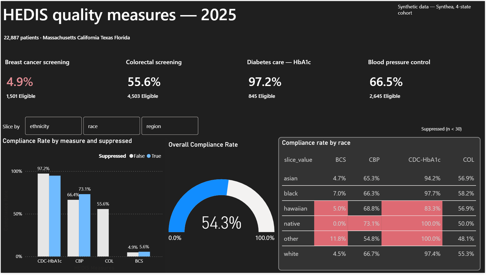

# HEDIS-Inspired Healthcare Quality Analytics


An end-to-end healthcare analytics pipeline that ingests synthetic patient data, builds a medallion (Bronze/Silver/Gold) architecture in Databricks, and calculates quality measures modeled on HEDIS methodology, reported through Power BI.

## Dashboard preview


*KPI summary across all four measures, sliced by demographic and region.*


**Important disclaimer:** This project implements measure logic *inspired by* HEDIS methodology. NCQA (the National Committee for Quality Assurance) owns the official HEDIS technical specifications and value sets, which are licensed, not public. This project does not use or claim to reproduce NCQA-certified logic. It demonstrates the same class of engineering and analytical problem — denominator/numerator/exclusion logic, continuous enrollment requirements, small-cell suppression — using publicly documented HEDIS concepts and self-derived code lists.

## Stack

- **Data source:** [Synthea](https://github.com/synthetichealth/synthea) — open-source synthetic patient generator
- **Storage:** AWS S3 (raw landing zone)
- **Processing:** Databricks (Free Edition), Unity Catalog, PySpark + SQL, Delta Lake
- **Architecture:** Medallion (Bronze → Silver → Gold)
- **Reporting:** Power BI Desktop, connected via Databricks SQL warehouse

## Dataset

- 22,887 synthetic patients across 4 states: Massachusetts, California, Texas, Florida (~5,000–5,900 per state)
- Generated using Synthea's GitHub `master` branch build (not the static website sample, which is Massachusetts-only and too small to support demographic breakdowns)
- Measurement year: **2025** (most recent complete calendar year in the generated data)

### Reproducing the dataset

```bash
git clone https://github.com/synthetichealth/synthea.git
cd synthea
./run_synthea -p 5000 Massachusetts --exporter.csv.export=true --exporter.fhir.export=false --exporter.baseDirectory="./output_MA/"
./run_synthea -p 5000 California   --exporter.csv.export=true --exporter.fhir.export=false --exporter.baseDirectory="./output_CA/"
./run_synthea -p 5000 Texas        --exporter.csv.export=true --exporter.fhir.export=false --exporter.baseDirectory="./output_TX/"
./run_synthea -p 5000 Florida      --exporter.csv.export=true --exporter.fhir.export=false --exporter.baseDirectory="./output_FL/"
```

CSVs from each state were combined per table using pandas, uploaded to S3, and ingested into Databricks Unity Catalog as external Delta tables.

**Note:** exact patient counts will differ on re-generation, since Synthea does not produce deterministic output unless a fixed seed (`-s`) is provided.

## Architecture

```
S3 (raw CSV, 16 Synthea tables)
   -> Bronze  (hedis.bronze)   raw ingestion, 1:1 with source files, schema-on-read
   -> Silver  (hedis.silver)   cleaned, typed, conformed dimension/fact tables
   -> Gold    (hedis.gold)     measure-level denominator/numerator/exclusion logic + reporting mart
   -> Power BI                 DAX-based compliance rate measures, sliced by race/region/ethnicity
```

### Silver layer tables
| Table | Description |
|---|---|
| `dim_patient` | One row per patient — demographics, derived `region` from state |
| `dim_payer` | Payer names, `is_insured` flag (excludes `NO_INSURANCE`) |
| `fact_enrollment` | Payer enrollment periods, used for continuous-enrollment logic |
| `fact_condition` | Diagnoses (SNOMED-CT) |
| `fact_observation` | Labs and vitals, numeric values cast and separated from text results |
| `fact_procedure` | Procedures (SNOMED-CT) |
| `fact_vitals_bp` | Systolic + diastolic blood pressure joined to one row per encounter, deduplicated |

### Gold layer tables
| Table | Description |
|---|---|
| `continuous_enrollment_2025` | Patients with no coverage gap over 45 days spanning the full measurement year |
| `bcs_measure`, `col_measure`, `cdc_hba1c_measure`, `cbp_measure` | Per-measure patient-level denominator/numerator/compliance |
| `measure_summary` | Rollup by measure × region / race / ethnicity, with compliance rate and suppression flag |
| `measure_summary_overall` | Unsliced rollup by measure only — used for top-level KPI reporting to avoid double-counting across slice types |

## Results at a glance

| Measure | Compliance rate | Eligible patients |
|---|---|---|
| CDC-HbA1c — Diabetes care | 97.2% | 845 |
| CBP — Blood pressure control | 66.5% | 2,645 |
| COL — Colorectal screening | 55.6% | 4,503 |
| BCS — Breast cancer screening | 4.9% | 1,501 |

*BCS and CDC-HbA1c rates fall outside real-world benchmarks — see [Known limitations](#known-limitations-synthetic-data-not-pipeline-defects) below for the root-cause analysis behind each.*

## Measures implemented

| Measure | Population | Numerator | Lookback |
|---|---|---|---|
| **BCS** — Breast Cancer Screening | Women, age 50–74 | Mammogram (SNOMED 71651007, 241055006, 24623002) | 27 months |
| **COL** — Colorectal Cancer Screening | Adults, age 45–75 | Colonoscopy (SNOMED 73761001) | 10 years |
| **CDC-HbA1c** — Comprehensive Diabetes Care | Diagnosed diabetics (SNOMED 44054006) | HbA1c test (LOINC 4548-4) | Measurement year |
| **CBP** — Controlling High Blood Pressure | Diagnosed hypertensives (SNOMED 59621000), age 18+ | Most recent BP reading < 140/90 | Measurement year |

**Note on COL:** the underlying dataset does not contain FIT/FOBT stool-based test observations, only colonoscopy procedures. Real HEDIS COL logic accepts multiple test types with different lookback windows; this implementation is colonoscopy-only as a result of what the source data supports.

## Key assumptions and design decisions

- **Continuous enrollment:** a patient counts as eligible if their combined insured coverage periods span the full measurement year with no single gap exceeding 45 days — modeled on NCQA's gap-tolerance approach rather than requiring one unbroken enrollment period (an initial stricter version of this logic returned near-zero eligible patients across every measure and was corrected).
- **Uninsured exclusion:** periods under the `NO_INSURANCE` payer are excluded from coverage entirely, not counted as valid enrollment.
- **Small-cell suppression:** any demographic slice (region, race, or ethnicity) with a denominator under 30 is flagged `suppressed = true` and its rate should not be interpreted as reliable — consistent with the general principle behind NCQA's small-cell suppression guidance.
- **Region mapping:** derived from patient state (Massachusetts → Northeast, California → West, Texas/Florida → South) since Synthea does not provide a native region field.
- **Exclusion codes (bilateral mastectomy for BCS, total colectomy for COL):** checked against the full dataset (`SELECT ... WHERE DESCRIPTION RLIKE '(?i)mastectomy'` on procedures, `'(?i)colectomy'` on conditions) — neither condition/procedure exists anywhere in this 22,887-patient dataset. Synthea's disease modules did not generate these cases in this generation run, so no exclusion filtering was implemented in `bcs_measure` or `col_measure`. This is a documented, verified absence, not an unhandled edge case.

## Known limitations (synthetic data, not pipeline defects)

- **BCS compliance rate (4.9%) is implausibly low relative to real-world benchmarks (typically 50–70%).** Investigation traced this to a lifetime volume issue, not a lookback-window bug: only 76 of 1,501 eligible women have *ever* had a qualifying mammogram in the entire dataset, at any point in their recorded history. This indicates Synthea's care-module for screening mammography does not consistently generate this procedure for the eligible population in this generation run. The pipeline logic (denominator, exclusion, numerator, lookback) is validated as correct; the underlying synthetic data volume for this specific procedure is the limiting factor.
- **CDC-HbA1c compliance (94–100%) is near ceiling**, well above real-world HEDIS benchmarks (typically 80–90%). Likely explanation: Synthea's diabetes care-plan module generates HbA1c testing as near-deterministic standard-of-care for simulated diabetic encounters, without modeling the missed-appointment and care-gap behaviors present in real patient populations.
- **CBP shows no missing-data cases** — every hypertensive patient in the eligible cohort has at least one BP reading in the measurement year. Real claims data typically shows some patients with no visits in a given year; Synthea's regular encounter generation for chronic-condition patients does not fully replicate this.

These are documented as characteristics of the synthetic data source, not findings about real-world care quality, and should not be read as clinical results.

## Suppression in practice

Out of 32 measure/slice combinations in `measure_summary`, 6 are suppressed — specifically the `hawaiian`, `native`, and `other` race categories on BCS and CDC-HbA1c, and `native` on CBP — all with denominators between 5 and 26. Every region slice and the `white`, `black`, and `asian` race categories clear the threshold and report normally. This is the expected outcome: suppression should be the exception affecting small minority groups, not the norm, and this dataset demonstrates that pattern correctly.

## Repository structure

```
/sql        Bronze, Silver, and Gold layer scripts, organized by layer
/docs       This README, data dictionary
/screenshots Power BI dashboard exports (interactive .pbix is not rendered by GitHub)
```

## Possible extensions (not yet built)

- Income-based (SDOH) compliance breakdown, using `patients.INCOME`, to mirror NCQA's Health Equity Accreditation approach of stratifying quality measures by social determinants, not just demographics
- Payer/product-line breakdown (Medicare / Medicaid / Commercial), which in real HEDIS reporting typically shows larger compliance differences than race or region
- Multi-year trend analysis, if a future dataset generation includes more than one full measurement year
